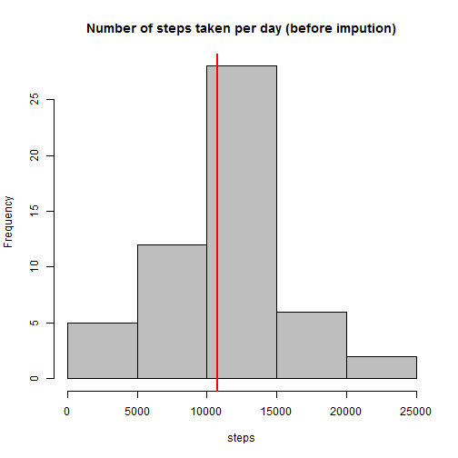
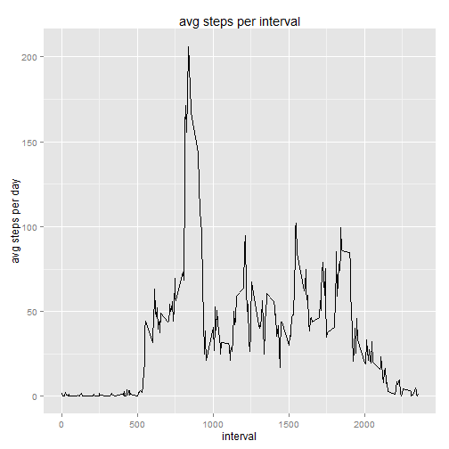
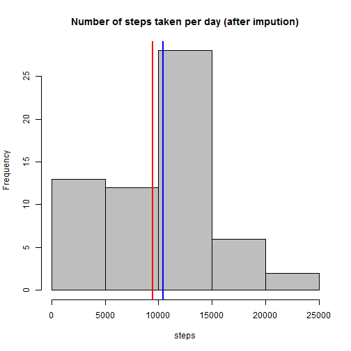

include necessary libraries


```r
library(xtable)
library(ggplot2)
library(plyr)
library(VIM)
```

###1. Download, load and preprocessing the data  

download the zip file and unzip it if folder does not exist already


```r
setInternet2(TRUE);

if (!file.exists("PersonalActivityMonitoring.zip")) {

        fileUrl <- "https://d396qusza40orc.cloudfront.net/repdata%2Fdata%2Factivity.zip"
        download.file(fileUrl, destfile = "PersonalActivityMonitoring.zip", mode = "wb")
        unzip("PersonalActivityMonitoring.zip")
}
```


Load the activity data file into data frame


```r
activitystage <- read.csv ("activity.csv")
```

convert date field to date data type

```r
activitystage$date <- as.Date(activitystage$date)
```

###2.What is mean total number of steps taken per day?  

To calculate the total steps per day, omit/remove rows with NA steps values


```r
cleanedactivity<-na.omit(activitystage)
```

use the cleaned activity data to calculate the aggregate steps taken per day


```r
totalactivity<-aggregate(steps ~ date, cleanedactivity, FUN=sum)
```

Print mean and median values before impution (or data enrichment by replacing NAs with valid values based on strategy).  After ignoring NA values in steps field, both mean and median values are pretty close as shown above in the table below.


```r
mean=mean(totalactivity$steps)
median=median(totalactivity$steps)
state<-'before impution'
t1<-totalactivity
t1<-cbind(state, mean, median)
print(xtable(t1),type="html" , include.rownames = FALSE)
```

<!-- html table generated in R 3.1.2 by xtable 1.7-4 package -->
<!-- Sat May 16 19:14:10 2015 -->
<table border=1>
<tr> <th> state </th> <th> mean </th> <th> median </th>  </tr>
  <tr> <td> before impution </td> <td> 10766.1886792453 </td> <td> 10765 </td> </tr>
   </table>


Plot the graph shownig the total number of steps taken each day. Mean and Median values are also highlighted in the graph. Since median and mean are pretty close, abline for median and mean are overlapping with each other  


```r
hist(totalactivity$steps, col=c("gray"),  main = "Number of steps taken per day (before impution)", xlab= "steps")
abline (v=median(totalactivity$steps), col="blue",lwd =2)
abline (v=mean(totalactivity$steps), col="red", lwd =2)
```

 
      
###3. What is the average daily activity pattern?

use the cleaned activity data to calculate the average steps per every 5 minutes interval across days  


```r
avgstepsperinterval = ddply(cleanedactivity, c("interval"), summarise, mean_temp = mean(steps))
```

plot line graph with average values on y axis and interval on x axis. Graph shows the 5 minute interval that has maximum average steps.   


```r
dayline<-ggplot(avgstepsperinterval, aes(x = interval, y = mean_temp)) + geom_line() + labs (title = "avg steps per interval", X= "interval",  y= "avg steps per day") 
plot(dayline)
```

 

###4. Imputing missing values  


calcualte the rows where steps data is missing before impution  


```r
TotalRowCount<-nrow(activitystage)
NARows<- activitystage[is.na(activitystage$steps),]
NARowCount<- nrow (NARows)
state<-'before impution'
y1<-totalactivity
y1<-cbind(state, TotalRowCount, NARowCount)
print(xtable(y1),type="html" , include.rownames = TRUE)
```

<!-- html table generated in R 3.1.2 by xtable 1.7-4 package -->
<!-- Sat May 16 19:14:10 2015 -->
<table border=1>
<tr> <th>  </th> <th> state </th> <th> TotalRowCount </th> <th> NARowCount </th>  </tr>
  <tr> <td align="right"> 1 </td> <td> before impution </td> <td> 17568 </td> <td> 2304 </td> </tr>
   </table>

Since strategy need not be sophisticated, I googled for variety of ways to impute the missing data and found [VIM](http://cran.r-project.org/web/packages/VIM/index.html/) package. KNN function within [VIM](http://cran.r-project.org/web/packages/VIM/index.html/) package helps in imputing the missing data using nearest neighbor averaging. I have picked nearest 1000 records and picked the median of those numbers  


```r
imputedactivity <- kNN(activitystage,  k=1000, numFun="median")
```

```
## Time difference of -3.261373 mins
```

calcualte the rows where steps data is missing after impution.  As shown in the table below, after the impution/enrichment process, there are no rows with NA values in the steps field

```r
TotalRowCount<-nrow(imputedactivity)
NARows<- activitystage[is.na(imputedactivity$steps),]
NARowCount<- nrow (NARows)
state<-'after impution'
y2<-imputedactivity
y2<-cbind(state, TotalRowCount, NARowCount)
y<-rbind(y1, y2)
print(xtable(y),type="html" , include.rownames = TRUE)
```

<!-- html table generated in R 3.1.2 by xtable 1.7-4 package -->
<!-- Sat May 16 19:17:26 2015 -->
<table border=1>
<tr> <th>  </th> <th> state </th> <th> TotalRowCount </th> <th> NARowCount </th>  </tr>
  <tr> <td align="right"> 1 </td> <td> before impution </td> <td> 17568 </td> <td> 2304 </td> </tr>
  <tr> <td align="right"> 2 </td> <td> after impution </td> <td> 17568 </td> <td> 0 </td> </tr>
   </table>


obtain the total number of steps taken per day using the new data set created in the above step  


```r
aggimputedactivity<-aggregate(steps ~ date, imputedactivity, FUN=sum)
```

Plot the histogram graph shownig the total number of steps taken each day using the new average steps per day data set created in the previous step. Mean and Median values are also highlighted in the graph. Unlike previous plot, with impution/enrichment process, median and mean are now apart and are clearly visible in the plot. 


```r
hist(aggimputedactivity$steps, col=c("gray"),  main = "Number of steps taken per day (after impution)", xlab= "steps")
abline (v=median(aggimputedactivity$steps), col="blue",lwd =2)
abline (v=mean(aggimputedactivity$steps), col="red", lwd =2)  
```

 

  
below is the mean and median values after the impution process 


```r
mean=mean(aggimputedactivity$steps)
median=median(aggimputedactivity$steps)
state<-'after impution'
t2<-cbind(state, mean, median)
print(xtable(t2), type = "html", include.rownames = TRUE)  
```

<!-- html table generated in R 3.1.2 by xtable 1.7-4 package -->
<!-- Sat May 16 19:17:26 2015 -->
<table border=1>
<tr> <th>  </th> <th> state </th> <th> mean </th> <th> median </th>  </tr>
  <tr> <td align="right"> 1 </td> <td> after impution </td> <td> 9460.06557377049 </td> <td> 10395 </td> </tr>
   </table>

  
Below table shows mean and median values steps taken per day before and after the impution process.  Mean has reduced after impution but median is pretty close to where it used be before impution process.


```r
t<-rbind(t1, t2)
print(xtable(t), type = "html", include.rownames = TRUE)  
```

<!-- html table generated in R 3.1.2 by xtable 1.7-4 package -->
<!-- Sat May 16 19:17:26 2015 -->
<table border=1>
<tr> <th>  </th> <th> state </th> <th> mean </th> <th> median </th>  </tr>
  <tr> <td align="right"> 1 </td> <td> before impution </td> <td> 10766.1886792453 </td> <td> 10765 </td> </tr>
  <tr> <td align="right"> 2 </td> <td> after impution </td> <td> 9460.06557377049 </td> <td> 10395 </td> </tr>
   </table>


