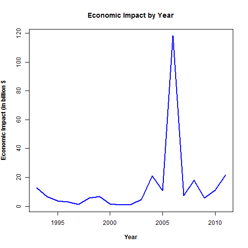
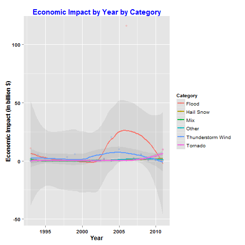
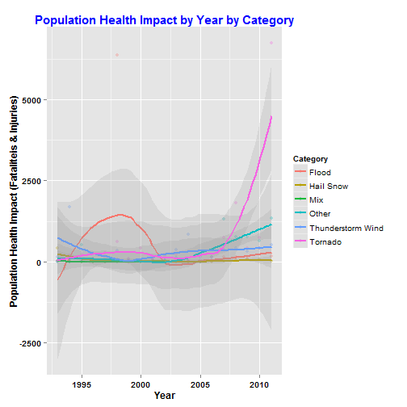

#Synopsis  

In this report we aim to analyze the impacts of Storms and other severe weather events on both public health and economic problems for communities and municipalities.  Our overall hypothesis is that both Public Health and Economic impacts have increased over the period of time (there are few exceptions due to specific weather events in specific year).  Flood has been main cause of concern in US with respect to economic impacts while Public health (including fatalities and injuries) are greatly caused by tornedos. For the purpose of analysis, public data from U.S. National Oceanic and Atmospheric Administration's (NOAA) storm database is used. This database tracks characteristics of major storms and weather events in the United States, including when and where they occur, as well as estimates of any fatalities, injuries, and property damage.

#Loading and Processing the Raw Data


```r
#include necessary libraries
library(xtable)
```

```
## Warning: package 'xtable' was built under R version 3.1.3
```

```r
library(ggplot2)
```

```
## Warning: package 'ggplot2' was built under R version 3.1.3
```

```r
library(plyr)
```

```
## Warning: package 'plyr' was built under R version 3.1.3
```

```r
library(lubridate)
```

```
## Warning: package 'lubridate' was built under R version 3.1.3
```

```
## 
## Attaching package: 'lubridate'
## 
## The following object is masked from 'package:plyr':
## 
##     here
```

```r
library(xtable)
```

Comma-separated-value file compressed via the bzip2 algorithm is downloaded from [U.S. National Oceanic and Atmospheric Administration's (NOAA)](https://d396qusza40orc.cloudfront.net/repdata%2Fdata%2FStormData.csv.bz2) storm database.


```r
setInternet2(TRUE);

filename <- "repdata_data_StormData.csv.bz2"

if (!file.exists("repdata_data_StormData.csv.bz2")) {
        fileUrl <- "https://d396qusza40orc.cloudfront.net/repdata%2Fdata%2FStormData.csv.bz2"
        download.file(fileUrl, destfile = "repdata_data_StormData.csv.bz2", mode = "wb")        
        }
d1 <- read.csv(bzfile(filename)) #read the .bz2 file directly using read.csv
```


```r
#obtain the structure of the data
str(d1)
```

```
## 'data.frame':	902297 obs. of  37 variables:
##  $ STATE__   : num  1 1 1 1 1 1 1 1 1 1 ...
##  $ BGN_DATE  : Factor w/ 16335 levels "1/1/1966 0:00:00",..: 6523 6523 4242 11116 2224 2224 2260 383 3980 3980 ...
##  $ BGN_TIME  : Factor w/ 3608 levels "00:00:00 AM",..: 272 287 2705 1683 2584 3186 242 1683 3186 3186 ...
##  $ TIME_ZONE : Factor w/ 22 levels "ADT","AKS","AST",..: 7 7 7 7 7 7 7 7 7 7 ...
##  $ COUNTY    : num  97 3 57 89 43 77 9 123 125 57 ...
##  $ COUNTYNAME: Factor w/ 29601 levels "","5NM E OF MACKINAC BRIDGE TO PRESQUE ISLE LT MI",..: 13513 1873 4598 10592 4372 10094 1973 23873 24418 4598 ...
##  $ STATE     : Factor w/ 72 levels "AK","AL","AM",..: 2 2 2 2 2 2 2 2 2 2 ...
##  $ EVTYPE    : Factor w/ 985 levels "   HIGH SURF ADVISORY",..: 834 834 834 834 834 834 834 834 834 834 ...
##  $ BGN_RANGE : num  0 0 0 0 0 0 0 0 0 0 ...
##  $ BGN_AZI   : Factor w/ 35 levels "","  N"," NW",..: 1 1 1 1 1 1 1 1 1 1 ...
##  $ BGN_LOCATI: Factor w/ 54429 levels "","- 1 N Albion",..: 1 1 1 1 1 1 1 1 1 1 ...
##  $ END_DATE  : Factor w/ 6663 levels "","1/1/1993 0:00:00",..: 1 1 1 1 1 1 1 1 1 1 ...
##  $ END_TIME  : Factor w/ 3647 levels ""," 0900CST",..: 1 1 1 1 1 1 1 1 1 1 ...
##  $ COUNTY_END: num  0 0 0 0 0 0 0 0 0 0 ...
##  $ COUNTYENDN: logi  NA NA NA NA NA NA ...
##  $ END_RANGE : num  0 0 0 0 0 0 0 0 0 0 ...
##  $ END_AZI   : Factor w/ 24 levels "","E","ENE","ESE",..: 1 1 1 1 1 1 1 1 1 1 ...
##  $ END_LOCATI: Factor w/ 34506 levels "","- .5 NNW",..: 1 1 1 1 1 1 1 1 1 1 ...
##  $ LENGTH    : num  14 2 0.1 0 0 1.5 1.5 0 3.3 2.3 ...
##  $ WIDTH     : num  100 150 123 100 150 177 33 33 100 100 ...
##  $ F         : int  3 2 2 2 2 2 2 1 3 3 ...
##  $ MAG       : num  0 0 0 0 0 0 0 0 0 0 ...
##  $ FATALITIES: num  0 0 0 0 0 0 0 0 1 0 ...
##  $ INJURIES  : num  15 0 2 2 2 6 1 0 14 0 ...
##  $ PROPDMG   : num  25 2.5 25 2.5 2.5 2.5 2.5 2.5 25 25 ...
##  $ PROPDMGEXP: Factor w/ 19 levels "","-","?","+",..: 17 17 17 17 17 17 17 17 17 17 ...
##  $ CROPDMG   : num  0 0 0 0 0 0 0 0 0 0 ...
##  $ CROPDMGEXP: Factor w/ 9 levels "","?","0","2",..: 1 1 1 1 1 1 1 1 1 1 ...
##  $ WFO       : Factor w/ 542 levels ""," CI","$AC",..: 1 1 1 1 1 1 1 1 1 1 ...
##  $ STATEOFFIC: Factor w/ 250 levels "","ALABAMA, Central",..: 1 1 1 1 1 1 1 1 1 1 ...
##  $ ZONENAMES : Factor w/ 25112 levels "","                                                                                                                               "| __truncated__,..: 1 1 1 1 1 1 1 1 1 1 ...
##  $ LATITUDE  : num  3040 3042 3340 3458 3412 ...
##  $ LONGITUDE : num  8812 8755 8742 8626 8642 ...
##  $ LATITUDE_E: num  3051 0 0 0 0 ...
##  $ LONGITUDE_: num  8806 0 0 0 0 ...
##  $ REMARKS   : Factor w/ 436781 levels "","-2 at Deer Park\n",..: 1 1 1 1 1 1 1 1 1 1 ...
##  $ REFNUM    : num  1 2 3 4 5 6 7 8 9 10 ...
```

```r
#obtain distinct records per fields
rapply(d1,function(x)length(unique(x)))
```

```
##    STATE__   BGN_DATE   BGN_TIME  TIME_ZONE     COUNTY COUNTYNAME 
##         70      16335       3608         22        557      29601 
##      STATE     EVTYPE  BGN_RANGE    BGN_AZI BGN_LOCATI   END_DATE 
##         72        985        272         35      54429       6663 
##   END_TIME COUNTY_END COUNTYENDN  END_RANGE    END_AZI END_LOCATI 
##       3647          1          1        266         24      34506 
##     LENGTH      WIDTH          F        MAG FATALITIES   INJURIES 
##        568        293          7        226         52        200 
##    PROPDMG PROPDMGEXP    CROPDMG CROPDMGEXP        WFO STATEOFFIC 
##       1390         19        432          9        542        250 
##  ZONENAMES   LATITUDE  LONGITUDE LATITUDE_E LONGITUDE_    REMARKS 
##      25112       1781       3841       1729       3778     436781 
##     REFNUM 
##     902297
```

#Data Cleaning and Processing

###Remove NA Data

There are about 902297 records in the data set.  We need to inspect these records closely. There 37 data columns but we are interested in specific set of columns only. We will validate those columns for NA data using complete.cases(http://stat.ethz.ch/R-manual/R-patched/library/stats/html/complete.cases.html)  


```r
#validate the data completeness for the subset of columns.  
d2<-d1[complete.cases(d1[, c("BGN_DATE", "EVTYPE","FATALITIES","INJURIES","PROPDMG", "PROPDMGEXP", "CROPDMG","CROPDMGEXP","REFNUM")]),]
nrow(d2)
```

```
## [1] 902297
```

As observed above there are no reduction in rows after checking for the completeness.  That means we have no NA data in any of the columns listed above


```r
#inspect the data type of individual columns of the data frame
sapply(d2, class)
```

```
##    STATE__   BGN_DATE   BGN_TIME  TIME_ZONE     COUNTY COUNTYNAME 
##  "numeric"   "factor"   "factor"   "factor"  "numeric"   "factor" 
##      STATE     EVTYPE  BGN_RANGE    BGN_AZI BGN_LOCATI   END_DATE 
##   "factor"   "factor"  "numeric"   "factor"   "factor"   "factor" 
##   END_TIME COUNTY_END COUNTYENDN  END_RANGE    END_AZI END_LOCATI 
##   "factor"  "numeric"  "logical"  "numeric"   "factor"   "factor" 
##     LENGTH      WIDTH          F        MAG FATALITIES   INJURIES 
##  "numeric"  "numeric"  "integer"  "numeric"  "numeric"  "numeric" 
##    PROPDMG PROPDMGEXP    CROPDMG CROPDMGEXP        WFO STATEOFFIC 
##  "numeric"   "factor"  "numeric"   "factor"   "factor"   "factor" 
##  ZONENAMES   LATITUDE  LONGITUDE LATITUDE_E LONGITUDE_    REMARKS 
##   "factor"  "numeric"  "numeric"  "numeric"  "numeric"   "factor" 
##     REFNUM 
##  "numeric"
```

###Correct the Data Type

Notice that data types of Date and certain text columns/fields are set as factors. We need to change them to appropriate data types.  


```r
#data type is changed for Date and Character fields of our interest
d2$BGN_DATE=as.Date(d2$BGN_DATE, format = "%m/%d/%Y")
d2$EVTYPE=as.character(d2$EVTYPE)
d2$PROPDMGEXP=as.character(d2$PROPDMGEXP)
d2$CROPDMGEXP=as.character(d2$CROPDMGEXP)
```


###Create small subset of data  

Create the small data frame with columns that we are interested in. 


```r
d3<-d2[c("BGN_DATE", "EVTYPE", "FATALITIES", "INJURIES", "PROPDMG", "PROPDMGEXP", "CROPDMG" , "CROPDMGEXP", "REFNUM" )]
head(d3)
```

```
##     BGN_DATE  EVTYPE FATALITIES INJURIES PROPDMG PROPDMGEXP CROPDMG
## 1 1950-04-18 TORNADO          0       15    25.0          K       0
## 2 1950-04-18 TORNADO          0        0     2.5          K       0
## 3 1951-02-20 TORNADO          0        2    25.0          K       0
## 4 1951-06-08 TORNADO          0        2     2.5          K       0
## 5 1951-11-15 TORNADO          0        2     2.5          K       0
## 6 1951-11-15 TORNADO          0        6     2.5          K       0
##   CROPDMGEXP REFNUM
## 1                 1
## 2                 2
## 3                 3
## 4                 4
## 5                 5
## 6                 6
```

Inspect Property and Crop Damage expense factor values. These are character fields denoting magnitude of the damage.  These columns are used in conjunction of PROPDMG and CROPDMG columns respectively to obtain the damage amounts


```r
#list out unique value of Property Data Expense values
unique(d3$PROPDMGEXP)
```

```
##  [1] "K" "M" ""  "B" "m" "+" "0" "5" "6" "?" "4" "2" "3" "h" "7" "H" "-"
## [18] "1" "8"
```

```r
#list out unique value of Crop Damage Expense values
unique(d3$CROPDMGEXP)
```

```
## [1] ""  "M" "K" "m" "B" "?" "0" "k" "2"
```

```r
summary(d3$PROPDMGEXP)
```

```
##    Length     Class      Mode 
##    902297 character character
```

```r
summary(d3$CROPDMGEXP)
```

```
##    Length     Class      Mode 
##    902297 character character
```

###Translate Damaage Magnitude into Numbers  

As per the documentation, [National Weather Service Storm Data](https://d396qusza40orc.cloudfront.net/repdata%2Fpeer2_doc%2Fpd01016005curr.pdf):  
.k or K stands for damage in "thousands".  
.m or M stands for damage in "millions"  
.b or B stands for damage in "billions" 


Note: h or H stands for "hundreds" but it has been eliminated from our analysis due to low economic impacts. 

Other character magnitude values are not important from analysis point of view. We will limit our analysis to those records that have damage values either in thousands, millions or billions.

We will create two numeric variables based on property and crop property damage magnitude values as follows. 


```r
#we will assign NA to numeric magnitude factor if character magnitude is not in (k, K, m, M, b, B)
d3=within(d3,{
        prpfactor=NA
        prpfactor[PROPDMGEXP %in% c('k','K')]=1000 #If property damage magnitude is k or K, property damage field PROPDMG will be multiplied by 1000 
        prpfactor[PROPDMGEXP %in% c('m','M')]=1000000 #If propertydamage magnitude is m or M, property damage field PROPDMG will be multiplied by 1000000
        prpfactor[PROPDMGEXP %in% c('b','B')]=1000000000 #If property damage magnitude is b or B, property damage field PROPDMG will be multiplied by 1000000000
})

d3=within(d3,{
        crpfactor=NA
        crpfactor[CROPDMGEXP %in% c('k','K')]=1000 #If crop damage magnitude is k or K, property damage field PROPDMG will be multiplied by 1000 
        crpfactor[CROPDMGEXP %in% c('m','M')]=1000000 #If crop damage magnitude is m or M, property damage field PROPDMG will be multiplied by 1000000
        crpfactor[CROPDMGEXP %in% c('b','B')]=1000000000 #If crop magnitude is b or B, property damage field PROPDMG will be multiplied by 1000000000
})

#check if numeric magnitude data is correctly assigned or not
head(d3,2)
```

```
##     BGN_DATE  EVTYPE FATALITIES INJURIES PROPDMG PROPDMGEXP CROPDMG
## 1 1950-04-18 TORNADO          0       15    25.0          K       0
## 2 1950-04-18 TORNADO          0        0     2.5          K       0
##   CROPDMGEXP REFNUM prpfactor crpfactor
## 1                 1      1000        NA
## 2                 2      1000        NA
```

```r
tail(d3, 2)
```

```
##          BGN_DATE     EVTYPE FATALITIES INJURIES PROPDMG PROPDMGEXP
## 902296 2011-11-09   BLIZZARD          0        0       0          K
## 902297 2011-11-28 HEAVY SNOW          0        0       0          K
##        CROPDMG CROPDMGEXP REFNUM prpfactor crpfactor
## 902296       0          K 902296      1000      1000
## 902297       0          K 902297      1000      1000
```

Now, lets analyze the distinct event data as available in the data set.   


```r
unique(d3$EVTYPE)
```

```
##   [1] "TORNADO"                        "TSTM WIND"                     
##   [3] "HAIL"                           "FREEZING RAIN"                 
##   [5] "SNOW"                           "ICE STORM/FLASH FLOOD"         
##   [7] "SNOW/ICE"                       "WINTER STORM"                  
##   [9] "HURRICANE OPAL/HIGH WINDS"      "THUNDERSTORM WINDS"            
##  [11] "RECORD COLD"                    "HURRICANE ERIN"                
##  [13] "HURRICANE OPAL"                 "HEAVY RAIN"                    
##  [15] "LIGHTNING"                      "THUNDERSTORM WIND"             
##  [17] "DENSE FOG"                      "RIP CURRENT"                   
##  [19] "THUNDERSTORM WINS"              "FLASH FLOOD"                   
##  [21] "FLASH FLOODING"                 "HIGH WINDS"                    
##  [23] "FUNNEL CLOUD"                   "TORNADO F0"                    
##  [25] "THUNDERSTORM WINDS LIGHTNING"   "THUNDERSTORM WINDS/HAIL"       
##  [27] "HEAT"                           "WIND"                          
##  [29] "LIGHTING"                       "HEAVY RAINS"                   
##  [31] "LIGHTNING AND HEAVY RAIN"       "FUNNEL"                        
##  [33] "WALL CLOUD"                     "FLOODING"                      
##  [35] "THUNDERSTORM WINDS HAIL"        "FLOOD"                         
##  [37] "COLD"                           "HEAVY RAIN/LIGHTNING"          
##  [39] "FLASH FLOODING/THUNDERSTORM WI" "WALL CLOUD/FUNNEL CLOUD"       
##  [41] "THUNDERSTORM"                   "WATERSPOUT"                    
##  [43] "EXTREME COLD"                   "HAIL 1.75)"                    
##  [45] "LIGHTNING/HEAVY RAIN"           "HIGH WIND"                     
##  [47] "BLIZZARD"                       "BLIZZARD WEATHER"              
##  [49] "WIND CHILL"                     "BREAKUP FLOODING"              
##  [51] "HIGH WIND/BLIZZARD"             "RIVER FLOOD"                   
##  [53] "HEAVY SNOW"                     "FREEZE"                        
##  [55] "COASTAL FLOOD"                  "HIGH WIND AND HIGH TIDES"      
##  [57] "HIGH WIND/BLIZZARD/FREEZING RA" "HIGH TIDES"                    
##  [59] "HIGH WIND AND HEAVY SNOW"       "RECORD COLD AND HIGH WIND"     
##  [61] "RECORD HIGH TEMPERATURE"        "RECORD HIGH"                   
##  [63] "HIGH WINDS HEAVY RAINS"         "HIGH WIND/ BLIZZARD"           
##  [65] "ICE STORM"                      "BLIZZARD/HIGH WIND"            
##  [67] "HIGH WIND/LOW WIND CHILL"       "HEAVY SNOW/HIGH"               
##  [69] "RECORD LOW"                     "HIGH WINDS AND WIND CHILL"     
##  [71] "HEAVY SNOW/HIGH WINDS/FREEZING" "LOW TEMPERATURE RECORD"        
##  [73] "AVALANCHE"                      "MARINE MISHAP"                 
##  [75] "WIND CHILL/HIGH WIND"           "HIGH WIND/WIND CHILL/BLIZZARD" 
##  [77] "HIGH WIND/WIND CHILL"           "HIGH WIND/HEAVY SNOW"          
##  [79] "HIGH TEMPERATURE RECORD"        "FLOOD WATCH/"                  
##  [81] "RECORD HIGH TEMPERATURES"       "HIGH WIND/SEAS"                
##  [83] "HIGH WINDS/HEAVY RAIN"          "HIGH SEAS"                     
##  [85] "SEVERE TURBULENCE"              "RECORD RAINFALL"               
##  [87] "RECORD SNOWFALL"                "RECORD WARMTH"                 
##  [89] "HEAVY SNOW/WIND"                "EXTREME HEAT"                  
##  [91] "WIND DAMAGE"                    "DUST STORM"                    
##  [93] "APACHE COUNTY"                  "SLEET"                         
##  [95] "HAIL STORM"                     "FUNNEL CLOUDS"                 
##  [97] "FLASH FLOODS"                   "DUST DEVIL"                    
##  [99] "EXCESSIVE HEAT"                 "THUNDERSTORM WINDS/FUNNEL CLOU"
## [101] "WINTER STORM/HIGH WIND"         "WINTER STORM/HIGH WINDS"       
## [103] "GUSTY WINDS"                    "STRONG WINDS"                  
## [105] "FLOODING/HEAVY RAIN"            "SNOW AND WIND"                 
## [107] "HEAVY SURF COASTAL FLOODING"    "HEAVY SURF"                    
## [109] "HEAVY PRECIPATATION"            "URBAN FLOODING"                
## [111] "HIGH SURF"                      "BLOWING DUST"                  
## [113] "URBAN/SMALL"                    "WILD FIRES"                    
## [115] "HIGH"                           "URBAN/SMALL FLOODING"          
## [117] "WATER SPOUT"                    "HIGH WINDS DUST STORM"         
## [119] "WINTER STORM HIGH WINDS"        "LOCAL FLOOD"                   
## [121] "WINTER STORMS"                  "MUDSLIDES"                     
## [123] "RAINSTORM"                      "SEVERE THUNDERSTORM"           
## [125] "SEVERE THUNDERSTORMS"           "SEVERE THUNDERSTORM WINDS"     
## [127] "THUNDERSTORMS WINDS"            "DRY MICROBURST"                
## [129] "FLOOD/FLASH FLOOD"              "FLOOD/RAIN/WINDS"              
## [131] "WINDS"                          "DRY MICROBURST 61"             
## [133] "THUNDERSTORMS"                  "FLASH FLOOD WINDS"             
## [135] "URBAN/SMALL STREAM FLOODING"    "MICROBURST"                    
## [137] "STRONG WIND"                    "HIGH WIND DAMAGE"              
## [139] "STREAM FLOODING"                "URBAN AND SMALL"               
## [141] "HEAVY SNOWPACK"                 "ICE"                           
## [143] "FLASH FLOOD/"                   "DOWNBURST"                     
## [145] "GUSTNADO AND"                   "FLOOD/RAIN/WIND"               
## [147] "WET MICROBURST"                 "DOWNBURST WINDS"               
## [149] "DRY MICROBURST WINDS"           "DRY MIRCOBURST WINDS"          
## [151] "DRY MICROBURST 53"              "SMALL STREAM URBAN FLOOD"      
## [153] "MICROBURST WINDS"               "HIGH WINDS 57"                 
## [155] "DRY MICROBURST 50"              "HIGH WINDS 66"                 
## [157] "HIGH WINDS 76"                  "HIGH WINDS 63"                 
## [159] "HIGH WINDS 67"                  "BLIZZARD/HEAVY SNOW"           
## [161] "HEAVY SNOW/HIGH WINDS"          "BLOWING SNOW"                  
## [163] "HIGH WINDS 82"                  "HIGH WINDS 80"                 
## [165] "HIGH WINDS 58"                  "FREEZING DRIZZLE"              
## [167] "LIGHTNING THUNDERSTORM WINDSS"  "DRY MICROBURST 58"             
## [169] "HAIL 75"                        "HIGH WINDS 73"                 
## [171] "HIGH WINDS 55"                  "LIGHT SNOW AND SLEET"          
## [173] "URBAN FLOOD"                    "DRY MICROBURST 84"             
## [175] "THUNDERSTORM WINDS 60"          "HEAVY RAIN/FLOODING"           
## [177] "THUNDERSTORM WINDSS"            "TORNADOS"                      
## [179] "GLAZE"                          "RECORD HEAT"                   
## [181] "COASTAL FLOODING"               "HEAT WAVE"                     
## [183] "FIRST SNOW"                     "FREEZING RAIN AND SLEET"       
## [185] "UNSEASONABLY DRY"               "UNSEASONABLY WET"              
## [187] "WINTRY MIX"                     "WINTER WEATHER"                
## [189] "UNSEASONABLY COLD"              "EXTREME/RECORD COLD"           
## [191] "RIP CURRENTS HEAVY SURF"        "SLEET/RAIN/SNOW"               
## [193] "UNSEASONABLY WARM"              "DROUGHT"                       
## [195] "NORMAL PRECIPITATION"           "HIGH WINDS/FLOODING"           
## [197] "DRY"                            "RAIN/SNOW"                     
## [199] "SNOW/RAIN/SLEET"                "WATERSPOUT/TORNADO"            
## [201] "WATERSPOUTS"                    "WATERSPOUT TORNADO"            
## [203] "URBAN/SMALL STREAM FLOOD"       "STORM SURGE"                   
## [205] "WATERSPOUT-TORNADO"             "WATERSPOUT-"                   
## [207] "TORNADOES, TSTM WIND, HAIL"     "TROPICAL STORM ALBERTO"        
## [209] "TROPICAL STORM"                 "TROPICAL STORM GORDON"         
## [211] "TROPICAL STORM JERRY"           "LIGHTNING THUNDERSTORM WINDS"  
## [213] "WAYTERSPOUT"                    "MINOR FLOODING"                
## [215] "LIGHTNING INJURY"               "URBAN/SMALL STREAM  FLOOD"     
## [217] "LIGHTNING AND THUNDERSTORM WIN" "THUNDERSTORM WINDS53"          
## [219] "URBAN AND SMALL STREAM FLOOD"   "URBAN AND SMALL STREAM"        
## [221] "WILDFIRE"                       "DAMAGING FREEZE"               
## [223] "THUNDERSTORM WINDS 13"          "SMALL HAIL"                    
## [225] "HEAVY SNOW/HIGH WIND"           "HURRICANE"                     
## [227] "WILD/FOREST FIRE"               "SMALL STREAM FLOODING"         
## [229] "MUD SLIDE"                      "LIGNTNING"                     
## [231] "FROST"                          "FREEZING RAIN/SNOW"            
## [233] "HIGH WINDS/"                    "THUNDERSNOW"                   
## [235] "FLOODS"                         "EXTREME WIND CHILLS"           
## [237] "COOL AND WET"                   "HEAVY RAIN/SNOW"               
## [239] "SMALL STREAM AND URBAN FLOODIN" "SMALL STREAM/URBAN FLOOD"      
## [241] "SNOW/SLEET/FREEZING RAIN"       "SEVERE COLD"                   
## [243] "GLAZE ICE"                      "COLD WAVE"                     
## [245] "EARLY SNOW"                     "SMALL STREAM AND URBAN FLOOD"  
## [247] "HIGH  WINDS"                    "RURAL FLOOD"                   
## [249] "SMALL STREAM AND"               "MUD SLIDES"                    
## [251] "HAIL 80"                        "EXTREME WIND CHILL"            
## [253] "COLD AND WET CONDITIONS"        "EXCESSIVE WETNESS"             
## [255] "GRADIENT WINDS"                 "HEAVY SNOW/BLOWING SNOW"       
## [257] "SLEET/ICE STORM"                "THUNDERSTORM WINDS URBAN FLOOD"
## [259] "THUNDERSTORM WINDS SMALL STREA" "ROTATING WALL CLOUD"           
## [261] "LARGE WALL CLOUD"               "COLD AIR FUNNEL"               
## [263] "GUSTNADO"                       "COLD AIR FUNNELS"              
## [265] "BLOWING SNOW- EXTREME WIND CHI" "SNOW AND HEAVY SNOW"           
## [267] "GROUND BLIZZARD"                "MAJOR FLOOD"                   
## [269] "SNOW/HEAVY SNOW"                "FREEZING RAIN/SLEET"           
## [271] "ICE JAM FLOODING"               "SNOW- HIGH WIND- WIND CHILL"   
## [273] "STREET FLOOD"                   "COLD AIR TORNADO"              
## [275] "SMALL STREAM FLOOD"             "FOG"                           
## [277] "THUNDERSTORM WINDS 2"           "FUNNEL CLOUD/HAIL"             
## [279] "ICE/SNOW"                       "TSTM WIND 51"                  
## [281] "TSTM WIND 50"                   "TSTM WIND 52"                  
## [283] "TSTM WIND 55"                   "HEAVY SNOW/BLIZZARD"           
## [285] "THUNDERSTORM WINDS 61"          "HAIL 0.75"                     
## [287] "THUNDERSTORM DAMAGE"            "THUNDERTORM WINDS"             
## [289] "HAIL 1.00"                      "HAIL/WINDS"                    
## [291] "SNOW AND ICE"                   "WIND STORM"                    
## [293] "SNOWSTORM"                      "GRASS FIRES"                   
## [295] "LAKE FLOOD"                     "PROLONG COLD"                  
## [297] "HAIL/WIND"                      "HAIL 1.75"                     
## [299] "THUNDERSTORMW 50"               "WIND/HAIL"                     
## [301] "SNOW AND ICE STORM"             "URBAN AND SMALL STREAM FLOODIN"
## [303] "THUNDERSTORMS WIND"             "THUNDERSTORM  WINDS"           
## [305] "HEAVY SNOW/SLEET"               "AGRICULTURAL FREEZE"           
## [307] "DROUGHT/EXCESSIVE HEAT"         "TUNDERSTORM WIND"              
## [309] "TROPICAL STORM DEAN"            "THUNDERTSORM WIND"             
## [311] "THUNDERSTORM WINDS/ HAIL"       "THUNDERSTORM WIND/LIGHTNING"   
## [313] "HEAVY RAIN/SEVERE WEATHER"      "THUNDESTORM WINDS"             
## [315] "WATERSPOUT/ TORNADO"            "LIGHTNING."                    
## [317] "WARM DRY CONDITIONS"            "HURRICANE-GENERATED SWELLS"    
## [319] "HEAVY SNOW/ICE STORM"           "RIVER AND STREAM FLOOD"        
## [321] "HIGH WIND 63"                   "COASTAL SURGE"                 
## [323] "HEAVY SNOW AND ICE STORM"       "MINOR FLOOD"                   
## [325] "HIGH WINDS/COASTAL FLOOD"       "RAIN"                          
## [327] "RIVER FLOODING"                 "SNOW/RAIN"                     
## [329] "ICE FLOES"                      "HIGH WAVES"                    
## [331] "SNOW SQUALLS"                   "SNOW SQUALL"                   
## [333] "THUNDERSTORM WIND G50"          "LIGHTNING FIRE"                
## [335] "BLIZZARD/FREEZING RAIN"         "HEAVY LAKE SNOW"               
## [337] "HEAVY SNOW/FREEZING RAIN"       "LAKE EFFECT SNOW"              
## [339] "HEAVY WET SNOW"                 "DUST DEVIL WATERSPOUT"         
## [341] "THUNDERSTORM WINDS/HEAVY RAIN"  "THUNDERSTROM WINDS"            
## [343] "THUNDERSTORM WINDS      LE CEN" "HAIL 225"                      
## [345] "BLIZZARD AND HEAVY SNOW"        "HEAVY SNOW AND ICE"            
## [347] "ICE STORM AND SNOW"             "HEAVY SNOW ANDBLOWING SNOW"    
## [349] "HEAVY SNOW/ICE"                 "BLIZZARD AND EXTREME WIND CHIL"
## [351] "LOW WIND CHILL"                 "BLOWING SNOW & EXTREME WIND CH"
## [353] "WATERSPOUT/"                    "URBAN/SMALL STREAM"            
## [355] "TORNADO F3"                     "FUNNEL CLOUD."                 
## [357] "TORNDAO"                        "HAIL 0.88"                     
## [359] "FLOOD/RIVER FLOOD"              "MUD SLIDES URBAN FLOODING"     
## [361] "TORNADO F1"                     "THUNDERSTORM WINDS G"          
## [363] "DEEP HAIL"                      "GLAZE/ICE STORM"               
## [365] "HEAVY SNOW/WINTER STORM"        "AVALANCE"                      
## [367] "BLIZZARD/WINTER STORM"          "DUST STORM/HIGH WINDS"         
## [369] "ICE JAM"                        "FOREST FIRES"                  
## [371] "THUNDERSTORM WIND G60"          "FROST\\FREEZE"                 
## [373] "THUNDERSTORM WINDS."            "HAIL 88"                       
## [375] "HAIL 175"                       "HVY RAIN"                      
## [377] "HAIL 100"                       "HAIL 150"                      
## [379] "HAIL 075"                       "THUNDERSTORM WIND G55"         
## [381] "HAIL 125"                       "THUNDERSTORM WINDS G60"        
## [383] "HARD FREEZE"                    "HAIL 200"                      
## [385] "THUNDERSTORM WINDS FUNNEL CLOU" "THUNDERSTORM WINDS 62"         
## [387] "WILDFIRES"                      "RECORD HEAT WAVE"              
## [389] "HEAVY SNOW AND HIGH WINDS"      "HEAVY SNOW/HIGH WINDS & FLOOD" 
## [391] "HAIL FLOODING"                  "THUNDERSTORM WINDS/FLASH FLOOD"
## [393] "HIGH WIND 70"                   "WET SNOW"                      
## [395] "HEAVY RAIN AND FLOOD"           "LOCAL FLASH FLOOD"             
## [397] "THUNDERSTORM WINDS 53"          "FLOOD/FLASH FLOODING"          
## [399] "TORNADO/WATERSPOUT"             "RAIN AND WIND"                 
## [401] "THUNDERSTORM WIND 59"           "THUNDERSTORM WIND 52"          
## [403] "COASTAL/TIDAL FLOOD"            "SNOW/ICE STORM"                
## [405] "BELOW NORMAL PRECIPITATION"     "RIP CURRENTS/HEAVY SURF"       
## [407] "FLASH FLOOD/FLOOD"              "EXCESSIVE RAIN"                
## [409] "RECORD/EXCESSIVE HEAT"          "HEAT WAVES"                    
## [411] "LIGHT SNOW"                     "THUNDERSTORM WIND 69"          
## [413] "HAIL DAMAGE"                    "LIGHTNING DAMAGE"              
## [415] "RECORD TEMPERATURES"            "LIGHTNING AND WINDS"           
## [417] "FOG AND COLD TEMPERATURES"      "OTHER"                         
## [419] "RECORD SNOW"                    "SNOW/COLD"                     
## [421] "FLASH FLOOD FROM ICE JAMS"      "TSTM WIND G58"                 
## [423] "MUDSLIDE"                       "HEAVY SNOW SQUALLS"            
## [425] "HEAVY SNOW/SQUALLS"             "HEAVY SNOW-SQUALLS"            
## [427] "ICY ROADS"                      "HEAVY MIX"                     
## [429] "SNOW FREEZING RAIN"             "LACK OF SNOW"                  
## [431] "SNOW/SLEET"                     "SNOW/FREEZING RAIN"            
## [433] "SNOW DROUGHT"                   "THUNDERSTORMW WINDS"           
## [435] "THUNDERSTORM WIND 60 MPH"       "THUNDERSTORM WIND 65MPH"       
## [437] "THUNDERSTORM WIND/ TREES"       "THUNDERSTORM WIND/AWNING"      
## [439] "THUNDERSTORM WIND 98 MPH"       "THUNDERSTORM WIND TREES"       
## [441] "TORRENTIAL RAIN"                "TORNADO F2"                    
## [443] "RIP CURRENTS"                   "HURRICANE EMILY"               
## [445] "HURRICANE GORDON"               "HURRICANE FELIX"               
## [447] "THUNDERSTORM WIND 59 MPH"       "THUNDERSTORM WINDS 63 MPH"     
## [449] "THUNDERSTORM WIND/ TREE"        "THUNDERSTORM DAMAGE TO"        
## [451] "THUNDERSTORM WIND 65 MPH"       "FLASH FLOOD - HEAVY RAIN"      
## [453] "THUNDERSTORM WIND."             "FLASH FLOOD/ STREET"           
## [455] "THUNDERSTORM WIND 59 MPH."      "HEAVY SNOW   FREEZING RAIN"    
## [457] "DAM FAILURE"                    "THUNDERSTORM HAIL"             
## [459] "HAIL 088"                       "THUNDERSTORM WINDSHAIL"        
## [461] "LIGHTNING  WAUSEON"             "THUDERSTORM WINDS"             
## [463] "ICE AND SNOW"                   "RECORD COLD/FROST"             
## [465] "STORM FORCE WINDS"              "FREEZING RAIN AND SNOW"        
## [467] "FREEZING RAIN SLEET AND"        "SOUTHEAST"                     
## [469] "HEAVY SNOW & ICE"               "FREEZING DRIZZLE AND FREEZING" 
## [471] "THUNDERSTORM WINDS AND"         "HAIL/ICY ROADS"                
## [473] "FLASH FLOOD/HEAVY RAIN"         "HEAVY RAIN; URBAN FLOOD WINDS;"
## [475] "HEAVY PRECIPITATION"            "TSTM WIND DAMAGE"              
## [477] "HIGH WATER"                     "FLOOD FLASH"                   
## [479] "RAIN/WIND"                      "THUNDERSTORM WINDS 50"         
## [481] "THUNDERSTORM WIND G52"          "FLOOD FLOOD/FLASH"             
## [483] "THUNDERSTORM WINDS 52"          "SNOW SHOWERS"                  
## [485] "THUNDERSTORM WIND G51"          "HEAT WAVE DROUGHT"             
## [487] "HEAVY SNOW/BLIZZARD/AVALANCHE"  "RECORD SNOW/COLD"              
## [489] "WET WEATHER"                    "UNSEASONABLY WARM AND DRY"     
## [491] "FREEZING RAIN SLEET AND LIGHT"  "RECORD/EXCESSIVE RAINFALL"     
## [493] "TIDAL FLOOD"                    "BEACH EROSIN"                  
## [495] "THUNDERSTORM WIND G61"          "FLOOD/FLASH"                   
## [497] "LOW TEMPERATURE"                "SLEET & FREEZING RAIN"         
## [499] "HEAVY RAINS/FLOODING"           "THUNDERESTORM WINDS"           
## [501] "THUNDERSTORM WINDS/FLOODING"    "THUNDEERSTORM WINDS"           
## [503] "HIGHWAY FLOODING"               "THUNDERSTORM W INDS"           
## [505] "HYPOTHERMIA"                    "FLASH FLOOD/ FLOOD"            
## [507] "THUNDERSTORM WIND 50"           "THUNERSTORM WINDS"             
## [509] "HEAVY RAIN/MUDSLIDES/FLOOD"     "MUD/ROCK SLIDE"                
## [511] "HIGH WINDS/COLD"                "BEACH EROSION/COASTAL FLOOD"   
## [513] "COLD/WINDS"                     "SNOW/ BITTER COLD"             
## [515] "THUNDERSTORM WIND 56"           "SNOW SLEET"                    
## [517] "DRY HOT WEATHER"                "COLD WEATHER"                  
## [519] "RAPIDLY RISING WATER"           "HAIL ALOFT"                    
## [521] "EARLY FREEZE"                   "ICE/STRONG WINDS"              
## [523] "EXTREME WIND CHILL/BLOWING SNO" "SNOW/HIGH WINDS"               
## [525] "HIGH WINDS/SNOW"                "EARLY FROST"                   
## [527] "SNOWMELT FLOODING"              "HEAVY SNOW AND STRONG WINDS"   
## [529] "SNOW ACCUMULATION"              "BLOWING SNOW/EXTREME WIND CHIL"
## [531] "SNOW/ ICE"                      "SNOW/BLOWING SNOW"             
## [533] "TORNADOES"                      "THUNDERSTORM WIND/HAIL"        
## [535] "FLASH FLOODING/FLOOD"           "HAIL 275"                      
## [537] "HAIL 450"                       "FLASH FLOOODING"               
## [539] "EXCESSIVE RAINFALL"             "THUNDERSTORMW"                 
## [541] "HAILSTORM"                      "TSTM WINDS"                    
## [543] "BEACH FLOOD"                    "HAILSTORMS"                    
## [545] "TSTMW"                          "FUNNELS"                       
## [547] "TSTM WIND 65)"                  "THUNDERSTORM WINDS/ FLOOD"     
## [549] "HEAVY RAINFALL"                 "HEAT/DROUGHT"                  
## [551] "HEAT DROUGHT"                   "NEAR RECORD SNOW"              
## [553] "LANDSLIDE"                      "HIGH WIND AND SEAS"            
## [555] "THUNDERSTORMWINDS"              "THUNDERSTORM WINDS HEAVY RAIN" 
## [557] "SLEET/SNOW"                     "EXCESSIVE"                     
## [559] "SNOW/SLEET/RAIN"                "WILD/FOREST FIRES"             
## [561] "HEAVY SEAS"                     "DUSTSTORM"                     
## [563] "FLOOD & HEAVY RAIN"             "?"                             
## [565] "THUNDERSTROM WIND"              "FLOOD/FLASHFLOOD"              
## [567] "SNOW AND COLD"                  "HOT PATTERN"                   
## [569] "PROLONG COLD/SNOW"              "BRUSH FIRES"                   
## [571] "SNOW\\COLD"                     "WINTER MIX"                    
## [573] "EXCESSIVE PRECIPITATION"        "SNOWFALL RECORD"               
## [575] "HOT/DRY PATTERN"                "DRY PATTERN"                   
## [577] "MILD/DRY PATTERN"               "MILD PATTERN"                  
## [579] "LANDSLIDES"                     "HEAVY SHOWERS"                 
## [581] "HEAVY SNOW AND"                 "HIGH WIND 48"                  
## [583] "LAKE-EFFECT SNOW"               "BRUSH FIRE"                    
## [585] "WATERSPOUT FUNNEL CLOUD"        "URBAN SMALL STREAM FLOOD"      
## [587] "SAHARAN DUST"                   "HEAVY SHOWER"                  
## [589] "URBAN FLOOD LANDSLIDE"          "HEAVY SWELLS"                  
## [591] "URBAN SMALL"                    "URBAN FLOODS"                  
## [593] "SMALL STREAM"                   "HEAVY RAIN/URBAN FLOOD"        
## [595] "FLASH FLOOD/LANDSLIDE"          "LANDSLIDE/URBAN FLOOD"         
## [597] "HEAVY RAIN/SMALL STREAM URBAN"  "FLASH FLOOD LANDSLIDES"        
## [599] "EXTREME WINDCHILL"              "URBAN/SML STREAM FLD"          
## [601] "TSTM WIND/HAIL"                 "Other"                         
## [603] "Record dry month"               "Temperature record"            
## [605] "Minor Flooding"                 "Ice jam flood (minor"          
## [607] "High Wind"                      "Tstm Wind"                     
## [609] "ROUGH SURF"                     "Wind"                          
## [611] "Heavy Surf"                     "Dust Devil"                    
## [613] "Wind Damage"                    "Marine Accident"               
## [615] "Snow"                           "Freeze"                        
## [617] "Snow Squalls"                   "Coastal Flooding"              
## [619] "Heavy Rain"                     "Strong Wind"                   
## [621] "COASTAL STORM"                  "COASTALFLOOD"                  
## [623] "Erosion/Cstl Flood"             "Heavy Rain and Wind"           
## [625] "Light Snow/Flurries"            "Wet Month"                     
## [627] "Wet Year"                       "Tidal Flooding"                
## [629] "River Flooding"                 "Damaging Freeze"               
## [631] "Beach Erosion"                  "Hot and Dry"                   
## [633] "Flood/Flash Flood"              "Icy Roads"                     
## [635] "High Surf"                      "Heavy Rain/High Surf"          
## [637] "Thunderstorm Wind"              "Rain Damage"                   
## [639] "Unseasonable Cold"              "Early Frost"                   
## [641] "Wintry Mix"                     "blowing snow"                  
## [643] "STREET FLOODING"                "Record Cold"                   
## [645] "Extreme Cold"                   "Ice Fog"                       
## [647] "Excessive Cold"                 "Torrential Rainfall"           
## [649] "Freezing Rain"                  "Landslump"                     
## [651] "Late-season Snowfall"           "Hurricane Edouard"             
## [653] "Coastal Storm"                  "Flood"                         
## [655] "HEAVY RAIN/WIND"                "TIDAL FLOODING"                
## [657] "Winter Weather"                 "Snow squalls"                  
## [659] "Strong Winds"                   "Strong winds"                  
## [661] "RECORD WARM TEMPS."             "Ice/Snow"                      
## [663] "Mudslide"                       "Glaze"                         
## [665] "Extended Cold"                  "Snow Accumulation"             
## [667] "Freezing Fog"                   "Drifting Snow"                 
## [669] "Whirlwind"                      "Heavy snow shower"             
## [671] "Heavy rain"                     "LATE SNOW"                     
## [673] "Record May Snow"                "Record Winter Snow"            
## [675] "Heavy Precipitation"            " COASTAL FLOOD"                
## [677] "Record temperature"             "Light snow"                    
## [679] "Late Season Snowfall"           "Gusty Wind"                    
## [681] "small hail"                     "Light Snow"                    
## [683] "MIXED PRECIP"                   "Black Ice"                     
## [685] "Mudslides"                      "Gradient wind"                 
## [687] "Snow and Ice"                   "Freezing Spray"                
## [689] "Summary Jan 17"                 "Summary of March 14"           
## [691] "Summary of March 23"            "Summary of March 24"           
## [693] "Summary of April 3rd"           "Summary of April 12"           
## [695] "Summary of April 13"            "Summary of April 21"           
## [697] "Summary August 11"              "Summary of April 27"           
## [699] "Summary of May 9-10"            "Summary of May 10"             
## [701] "Summary of May 13"              "Summary of May 14"             
## [703] "Summary of May 22 am"           "Summary of May 22 pm"          
## [705] "Heatburst"                      "Summary of May 26 am"          
## [707] "Summary of May 26 pm"           "Metro Storm, May 26"           
## [709] "Summary of May 31 am"           "Summary of May 31 pm"          
## [711] "Summary of June 3"              "Summary of June 4"             
## [713] "Summary June 5-6"               "Summary June 6"                
## [715] "Summary of June 11"             "Summary of June 12"            
## [717] "Summary of June 13"             "Summary of June 15"            
## [719] "Summary of June 16"             "Summary June 18-19"            
## [721] "Summary of June 23"             "Summary of June 24"            
## [723] "Summary of June 30"             "Summary of July 2"             
## [725] "Summary of July 3"              "Summary of July 11"            
## [727] "Summary of July 22"             "Summary July 23-24"            
## [729] "Summary of July 26"             "Summary of July 29"            
## [731] "Summary of August 1"            "Summary August 2-3"            
## [733] "Summary August 7"               "Summary August 9"              
## [735] "Summary August 10"              "Summary August 17"             
## [737] "Summary August 21"              "Summary August 28"             
## [739] "Summary September 4"            "Summary September 20"          
## [741] "Summary September 23"           "Summary Sept. 25-26"           
## [743] "Summary: Oct. 20-21"            "Summary: October 31"           
## [745] "Summary: Nov. 6-7"              "Summary: Nov. 16"              
## [747] "Microburst"                     "wet micoburst"                 
## [749] "Hail(0.75)"                     "Funnel Cloud"                  
## [751] "Urban Flooding"                 "No Severe Weather"             
## [753] "Urban flood"                    "Urban Flood"                   
## [755] "Cold"                           "Summary of May 22"             
## [757] "Summary of June 6"              "Summary August 4"              
## [759] "Summary of June 10"             "Summary of June 18"            
## [761] "Summary September 3"            "Summary: Sept. 18"             
## [763] "Coastal Flood"                  "coastal flooding"              
## [765] "Small Hail"                     "Record Temperatures"           
## [767] "Light Snowfall"                 "Freezing Drizzle"              
## [769] "Gusty wind/rain"                "GUSTY WIND/HVY RAIN"           
## [771] "Blowing Snow"                   "Early snowfall"                
## [773] "Monthly Snowfall"               "Record Heat"                   
## [775] "Seasonal Snowfall"              "Monthly Rainfall"              
## [777] "Cold Temperature"               "Sml Stream Fld"                
## [779] "Heat Wave"                      "MUDSLIDE/LANDSLIDE"            
## [781] "Saharan Dust"                   "Volcanic Ash"                  
## [783] "Volcanic Ash Plume"             "Thundersnow shower"            
## [785] "NONE"                           "COLD AND SNOW"                 
## [787] "DAM BREAK"                      "TSTM WIND (G45)"               
## [789] "SLEET/FREEZING RAIN"            "BLACK ICE"                     
## [791] "BLOW-OUT TIDES"                 "UNSEASONABLY COOL"             
## [793] "TSTM HEAVY RAIN"                "Gusty Winds"                   
## [795] "GUSTY WIND"                     "TSTM WIND 40"                  
## [797] "TSTM WIND 45"                   "TSTM WIND (41)"                
## [799] "TSTM WIND (G40)"                "TSTM WND"                      
## [801] "Wintry mix"                     " TSTM WIND"                    
## [803] "Frost"                          "Frost/Freeze"                  
## [805] "RAIN (HEAVY)"                   "Record Warmth"                 
## [807] "Prolong Cold"                   "Cold and Frost"                
## [809] "URBAN/SML STREAM FLDG"          "STRONG WIND GUST"              
## [811] "LATE FREEZE"                    "BLOW-OUT TIDE"                 
## [813] "Hypothermia/Exposure"           "HYPOTHERMIA/EXPOSURE"          
## [815] "Lake Effect Snow"               "Mixed Precipitation"           
## [817] "Record High"                    "COASTALSTORM"                  
## [819] "Snow and sleet"                 "Freezing rain"                 
## [821] "Gusty winds"                    "Blizzard Summary"              
## [823] "SUMMARY OF MARCH 24-25"         "SUMMARY OF MARCH 27"           
## [825] "SUMMARY OF MARCH 29"            "GRADIENT WIND"                 
## [827] "Icestorm/Blizzard"              "Flood/Strong Wind"             
## [829] "TSTM WIND AND LIGHTNING"        "gradient wind"                 
## [831] "Freezing drizzle"               "Mountain Snows"                
## [833] "URBAN/SMALL STRM FLDG"          "Heavy surf and wind"           
## [835] "Mild and Dry Pattern"           "COLD AND FROST"                
## [837] "TYPHOON"                        "HIGH SWELLS"                   
## [839] "HIGH  SWELLS"                   "VOLCANIC ASH"                  
## [841] "DRY SPELL"                      " LIGHTNING"                    
## [843] "BEACH EROSION"                  "UNSEASONAL RAIN"               
## [845] "EARLY RAIN"                     "PROLONGED RAIN"                
## [847] "WINTERY MIX"                    "COASTAL FLOODING/EROSION"      
## [849] "HOT SPELL"                      "UNSEASONABLY HOT"              
## [851] " TSTM WIND (G45)"               "TSTM WIND  (G45)"              
## [853] "HIGH WIND (G40)"                "TSTM WIND (G35)"               
## [855] "DRY WEATHER"                    "ABNORMAL WARMTH"               
## [857] "UNUSUAL WARMTH"                 "WAKE LOW WIND"                 
## [859] "MONTHLY RAINFALL"               "COLD TEMPERATURES"             
## [861] "COLD WIND CHILL TEMPERATURES"   "MODERATE SNOW"                 
## [863] "MODERATE SNOWFALL"              "URBAN/STREET FLOODING"         
## [865] "COASTAL EROSION"                "UNUSUAL/RECORD WARMTH"         
## [867] "BITTER WIND CHILL"              "BITTER WIND CHILL TEMPERATURES"
## [869] "SEICHE"                         "TSTM"                          
## [871] "COASTAL  FLOODING/EROSION"      "UNSEASONABLY WARM YEAR"        
## [873] "HYPERTHERMIA/EXPOSURE"          "ROCK SLIDE"                    
## [875] "ICE PELLETS"                    "PATCHY DENSE FOG"              
## [877] "RECORD COOL"                    "RECORD WARM"                   
## [879] "HOT WEATHER"                    "RECORD TEMPERATURE"            
## [881] "TROPICAL DEPRESSION"            "VOLCANIC ERUPTION"             
## [883] "COOL SPELL"                     "WIND ADVISORY"                 
## [885] "GUSTY WIND/HAIL"                "RED FLAG FIRE WX"              
## [887] "FIRST FROST"                    "EXCESSIVELY DRY"               
## [889] "SNOW AND SLEET"                 "LIGHT SNOW/FREEZING PRECIP"    
## [891] "VOG"                            "MONTHLY PRECIPITATION"         
## [893] "MONTHLY TEMPERATURE"            "RECORD DRYNESS"                
## [895] "EXTREME WINDCHILL TEMPERATURES" "MIXED PRECIPITATION"           
## [897] "DRY CONDITIONS"                 "REMNANTS OF FLOYD"             
## [899] "EARLY SNOWFALL"                 "FREEZING FOG"                  
## [901] "LANDSPOUT"                      "DRIEST MONTH"                  
## [903] "RECORD  COLD"                   "LATE SEASON HAIL"              
## [905] "EXCESSIVE SNOW"                 "DRYNESS"                       
## [907] "FLOOD/FLASH/FLOOD"              "WIND AND WAVE"                 
## [909] "LIGHT FREEZING RAIN"            " WIND"                         
## [911] "MONTHLY SNOWFALL"               "RECORD PRECIPITATION"          
## [913] "ICE ROADS"                      "ROUGH SEAS"                    
## [915] "UNSEASONABLY WARM/WET"          "UNSEASONABLY COOL & WET"       
## [917] "UNUSUALLY WARM"                 "TSTM WIND G45"                 
## [919] "NON SEVERE HAIL"                "NON-SEVERE WIND DAMAGE"        
## [921] "UNUSUALLY COLD"                 "WARM WEATHER"                  
## [923] "LANDSLUMP"                      "THUNDERSTORM WIND (G40)"       
## [925] "UNSEASONABLY WARM & WET"        " FLASH FLOOD"                  
## [927] "LOCALLY HEAVY RAIN"             "WIND GUSTS"                    
## [929] "UNSEASONAL LOW TEMP"            "HIGH SURF ADVISORY"            
## [931] "LATE SEASON SNOW"               "GUSTY LAKE WIND"               
## [933] "ABNORMALLY DRY"                 "WINTER WEATHER MIX"            
## [935] "RED FLAG CRITERIA"              "WND"                           
## [937] "CSTL FLOODING/EROSION"          "SMOKE"                         
## [939] " WATERSPOUT"                    "SNOW ADVISORY"                 
## [941] "EXTREMELY WET"                  "UNUSUALLY LATE SNOW"           
## [943] "VERY DRY"                       "RECORD LOW RAINFALL"           
## [945] "ROGUE WAVE"                     "PROLONG WARMTH"                
## [947] "ACCUMULATED SNOWFALL"           "FALLING SNOW/ICE"              
## [949] "DUST DEVEL"                     "NON-TSTM WIND"                 
## [951] "NON TSTM WIND"                  "GUSTY THUNDERSTORM WINDS"      
## [953] "PATCHY ICE"                     "HEAVY RAIN EFFECTS"            
## [955] "EXCESSIVE HEAT/DROUGHT"         "NORTHERN LIGHTS"               
## [957] "MARINE TSTM WIND"               "   HIGH SURF ADVISORY"         
## [959] "HAZARDOUS SURF"                 "FROST/FREEZE"                  
## [961] "WINTER WEATHER/MIX"             "ASTRONOMICAL HIGH TIDE"        
## [963] "WHIRLWIND"                      "VERY WARM"                     
## [965] "ABNORMALLY WET"                 "TORNADO DEBRIS"                
## [967] "EXTREME COLD/WIND CHILL"        "ICE ON ROAD"                   
## [969] "DROWNING"                       "GUSTY THUNDERSTORM WIND"       
## [971] "MARINE HAIL"                    "HIGH SURF ADVISORIES"          
## [973] "HURRICANE/TYPHOON"              "HEAVY SURF/HIGH SURF"          
## [975] "SLEET STORM"                    "STORM SURGE/TIDE"              
## [977] "COLD/WIND CHILL"                "MARINE HIGH WIND"              
## [979] "TSUNAMI"                        "DENSE SMOKE"                   
## [981] "LAKESHORE FLOOD"                "MARINE THUNDERSTORM WIND"      
## [983] "MARINE STRONG WIND"             "ASTRONOMICAL LOW TIDE"         
## [985] "VOLCANIC ASHFALL"
```


###Categorize the Individual Weather Events  

As observed above, Event Type has 985 distinct values which is way more than what is documented in the [National Weather Service Storm Data](https://d396qusza40orc.cloudfront.net/repdata%2Fpeer2_doc%2Fpd01016005curr.pdf).  We would need to group Event Types available in the data set by grouping the multipel Event Types together to futther analyze the weather event data set. 

First step with process is limit the data set by eliminating those records which do not have valid property and crop damanage magnitude set. We will create the smaller subset by eliminating those rows that have magnitude data other than (k, K, m, M, b, B).  This will reduce the number of records that we have to analyze and investigate considerabley. 


```r
d4<-d3[complete.cases(d3[, c("BGN_DATE", "EVTYPE", "FATALITIES", "INJURIES", "PROPDMG", "CROPDMG", "prpfactor","crpfactor","REFNUM" )]),]
```


We will create new column called "eventcategory" that will be used in later part of this analysis to group event types. 


```r
#while populating event group column, change the data to lower case. This will reduce the substituions in the later stage.
d4$eventcategory<-tolower(d4$EVTYPE)
```

Let's explore into small data subset created in the previous steps


```r
#obtain the structure of the small data set
str(d4)
```

```
## 'data.frame':	279537 obs. of  12 variables:
##  $ BGN_DATE     : Date, format: "1995-10-04" "1994-06-26" ...
##  $ EVTYPE       : chr  "HURRICANE OPAL/HIGH WINDS" "THUNDERSTORM WINDS" "HURRICANE ERIN" "HURRICANE OPAL" ...
##  $ FATALITIES   : num  2 0 0 0 0 0 0 0 0 0 ...
##  $ INJURIES     : num  0 0 0 0 0 0 2 5 0 0 ...
##  $ PROPDMG      : num  0.1 5 25 48 20 50 500 500 500 5 ...
##  $ PROPDMGEXP   : chr  "B" "M" "M" "M" ...
##  $ CROPDMG      : num  10 500 1 4 10 50 50 5 50 15 ...
##  $ CROPDMGEXP   : chr  "M" "K" "M" "M" ...
##  $ REFNUM       : num  187566 188271 187568 187570 187571 ...
##  $ prpfactor    : num  1e+09 1e+06 1e+06 1e+06 1e+06 1e+03 1e+03 1e+03 1e+03 1e+03 ...
##  $ crpfactor    : num  1e+06 1e+03 1e+06 1e+06 1e+06 1e+03 1e+03 1e+03 1e+03 1e+03 ...
##  $ eventcategory: chr  "hurricane opal/high winds" "thunderstorm winds" "hurricane erin" "hurricane opal" ...
```

```r
#obtain the unique event type values
unique(d4$EVTYPE)
```

```
##   [1] "HURRICANE OPAL/HIGH WINDS"     "THUNDERSTORM WINDS"           
##   [3] "HURRICANE ERIN"                "HURRICANE OPAL"               
##   [5] "TORNADO"                       "THUNDERSTORM WINDS/HAIL"      
##   [7] "FLASH FLOOD"                   "FLASH FLOODING"               
##   [9] "THUNDERSTORM WINDS HAIL"       "FLOODING"                     
##  [11] "HEAVY RAIN"                    "HIGH WINDS HEAVY RAINS"       
##  [13] "FLOOD"                         "THUNDERSTORM WIND"            
##  [15] "RIVER FLOOD"                   "HAIL"                         
##  [17] "WINTER STORM"                  "HIGH WINDS"                   
##  [19] "WINTER STORM HIGH WINDS"       "WINTER STORMS"                
##  [21] "SEVERE THUNDERSTORMS"          "SEVERE THUNDERSTORM WINDS"    
##  [23] "THUNDERSTORMS"                 "FLOOD/FLASH FLOOD"            
##  [25] "LIGHTNING"                     "HEAVY SNOW"                   
##  [27] "TORNADOES, TSTM WIND, HAIL"    "TROPICAL STORM"               
##  [29] "TROPICAL STORM GORDON"         "TROPICAL STORM JERRY"         
##  [31] "TORNADO F0"                    "BLIZZARD"                     
##  [33] "HEAT"                          "GLAZE ICE"                    
##  [35] "URBAN FLOOD"                   "URBAN FLOODING"               
##  [37] "THUNDERSTORMS WINDS"           "GUSTNADO"                     
##  [39] "COLD AIR TORNADO"              "WIND DAMAGE"                  
##  [41] "HIGH WIND"                     "SNOW"                         
##  [43] "HAIL/WINDS"                    "HAIL/WIND"                    
##  [45] "HEAVY RAINS"                   "TSTM WIND"                    
##  [47] "THUNDERSTORM WINDS LIGHTNING"  "ICE STORM"                    
##  [49] "DUST STORM/HIGH WINDS"         "ICE JAM FLOODING"             
##  [51] "FOREST FIRES"                  "HAIL 100"                     
##  [53] "HEAT WAVE"                     "HEAVY SNOW/HIGH WINDS & FLOOD"
##  [55] "FLOODS"                        "HURRICANE FELIX"              
##  [57] "THUNDERSTORM HAIL"             "THUDERSTORM WINDS"            
##  [59] "DROUGHT"                       "HEAT WAVE DROUGHT"            
##  [61] "COASTAL FLOODING"              "WINDS"                        
##  [63] "HEAVY RAINS/FLOODING"          "HIGH WINDS/COLD"              
##  [65] "RIVER FLOODING"                "WILD/FOREST FIRE"             
##  [67] "THUNDERSTORMS WIND"            "FLASH FLOOD/FLOOD"            
##  [69] "FLASH FLOODING/FLOOD"          "THUNDERSTORM WINDSS"          
##  [71] "TROPICAL STORM DEAN"           "THUNDERSTORM WINDS/ FLOOD"    
##  [73] "WILD/FOREST FIRES"             "WILDFIRES"                    
##  [75] "HURRICANE"                     "FUNNEL CLOUD"                 
##  [77] "EXTREME COLD"                  "TSTM WIND/HAIL"               
##  [79] "EXCESSIVE HEAT"                "URBAN/SML STREAM FLD"         
##  [81] "WATERSPOUT"                    "Heavy Rain/High Surf"         
##  [83] "STORM SURGE"                   "River Flooding"               
##  [85] "Frost/Freeze"                  "TYPHOON"                      
##  [87] "GUSTY WINDS"                   "ICY ROADS"                    
##  [89] "FOG"                           "DUST STORM"                   
##  [91] "FREEZE"                        "DRY MICROBURST"               
##  [93] "SMALL HAIL"                    "LANDSLIDE"                    
##  [95] "STRONG WIND"                   "EXTREME COLD/WIND CHILL"      
##  [97] "WILDFIRE"                      "HURRICANE/TYPHOON"            
##  [99] "HEAVY SURF/HIGH SURF"          "TROPICAL DEPRESSION"          
## [101] "RIP CURRENT"                   "ASTRONOMICAL HIGH TIDE"       
## [103] "COASTAL FLOOD"                 "DENSE FOG"                    
## [105] "FROST/FREEZE"                  "WINTER WEATHER"               
## [107] "HIGH SURF"                     "COLD/WIND CHILL"              
## [109] "TSUNAMI"                       "AVALANCHE"                    
## [111] "SLEET"                         "LAKE-EFFECT SNOW"             
## [113] "STORM SURGE/TIDE"              "FREEZING FOG"                 
## [115] "SEICHE"                        "LAKESHORE FLOOD"              
## [117] "MARINE THUNDERSTORM WIND"      "MARINE HAIL"                  
## [119] "MARINE STRONG WIND"            "DUST DEVIL"                   
## [121] "ASTRONOMICAL LOW TIDE"         "DENSE SMOKE"                  
## [123] "MARINE HIGH WIND"              "VOLCANIC ASHFALL"
```

As observed above, small subset of data has 279537 records. Distinct Event Types have reduced to 124 from 985.  Now, we need to club Event Types together.  

We will review each Event Type values and categorize them into one of the bucket: Flood, Thunderstorm Wind, Hail Snow, Tornedo.  Event Type that fall into more than one Event Type are lumped under "Mix" category. All the other Event Types are categorized as "Other"

Note: 
We are setting the Event Category one by one. Pretty sure there may be better options avaiable to group more than one Event Types into Category. But with limited time avaiable to complete the assignment, we had to proceed with the below option. Appreiciate any feedback or comment in improving this piece of code.  


```r
#Categorize all Flood related events
d4$eventcategory[d4$eventcategory=='flash flood']<-'Flood'
d4$eventcategory[d4$eventcategory=='flash flooding']<-'Flood'
d4$eventcategory[d4$eventcategory=='flooding']<-'Flood'
d4$eventcategory[d4$eventcategory=='heavy rain']<-'Flood'
d4$eventcategory[d4$eventcategory=='flood']<-'Flood'
d4$eventcategory[d4$eventcategory=='river flood']<-'Flood'
d4$eventcategory[d4$eventcategory=='flood/flash flood']<-'Flood'
d4$eventcategory[d4$eventcategory=='urban flood']<-'Flood'
d4$eventcategory[d4$eventcategory=='urban flooding']<-'Flood'
d4$eventcategory[d4$eventcategory=='floods']<-'Flood'
d4$eventcategory[d4$eventcategory=='coastal flooding']<-'Flood'
d4$eventcategory[d4$eventcategory=='heavy rains/flooding']<-'Flood'
d4$eventcategory[d4$eventcategory=='river flooding']<-'Flood'
d4$eventcategory[d4$eventcategory=='flash flood/flood']<-'Flood'
d4$eventcategory[d4$eventcategory=='flash flooding/flood']<-'Flood'
d4$eventcategory[d4$eventcategory=='urban/sml stream fld']<-'Flood'
d4$eventcategory[d4$eventcategory=='waterspout']<-'Flood'
d4$eventcategory[d4$eventcategory=='heavy rain/high surf']<-'Flood'
d4$eventcategory[d4$eventcategory=='river flooding']<-'Flood'
d4$eventcategory[d4$eventcategory=='astronomical high tide']<-'Flood'
d4$eventcategory[d4$eventcategory=='coastal flood']<-'Flood'
d4$eventcategory[d4$eventcategory=='lakeshore flood']<-'Flood'


#Categorize all Thunderstorm and Wind related events
d4$eventcategory[d4$eventcategory=='hurricane opal/high winds']<-'Thunderstorm Wind'
d4$eventcategory[d4$eventcategory=='thunderstorm winds']<-'Thunderstorm Wind'
d4$eventcategory[d4$eventcategory=='hurricane erin']<-'Thunderstorm Wind'
d4$eventcategory[d4$eventcategory=='hurricane opal']<-'Thunderstorm Wind'
d4$eventcategory[d4$eventcategory=='thunderstorm wind']<-'Thunderstorm Wind'
d4$eventcategory[d4$eventcategory=='winter storm']<-'Thunderstorm Wind'
d4$eventcategory[d4$eventcategory=='high winds']<-'Thunderstorm Wind'
d4$eventcategory[d4$eventcategory=='winter storm high winds']<-'Thunderstorm Wind'
d4$eventcategory[d4$eventcategory=='winter storms']<-'Thunderstorm Wind'
d4$eventcategory[d4$eventcategory=='severe thunderstorms']<-'Thunderstorm Wind'
d4$eventcategory[d4$eventcategory=='severe thunderstorm winds']<-'Thunderstorm Wind'
d4$eventcategory[d4$eventcategory=='thunderstorms']<-'Thunderstorm Wind'
d4$eventcategory[d4$eventcategory=='tropical storm']<-'Thunderstorm Wind'
d4$eventcategory[d4$eventcategory=='tropical storm gordon']<-'Thunderstorm Wind'
d4$eventcategory[d4$eventcategory=='tropical storm jerry']<-'Thunderstorm Wind'
d4$eventcategory[d4$eventcategory=='thunderstorms winds']<-'Thunderstorm Wind'
d4$eventcategory[d4$eventcategory=='wind damage']<-'Thunderstorm Wind'
d4$eventcategory[d4$eventcategory=='high wind']<-'Thunderstorm Wind'
d4$eventcategory[d4$eventcategory=='tstm wind']<-'Thunderstorm Wind'
d4$eventcategory[d4$eventcategory=='thunderstorm winds lightning']<-'Thunderstorm Wind'
d4$eventcategory[d4$eventcategory=='ice storm']<-'Thunderstorm Wind'
d4$eventcategory[d4$eventcategory=='dust storm/high winds']<-'Thunderstorm Wind'
d4$eventcategory[d4$eventcategory=='hurricane felix']<-'Thunderstorm Wind'
d4$eventcategory[d4$eventcategory=='thuderstorm winds']<-'Thunderstorm Wind'
d4$eventcategory[d4$eventcategory=='winds']<-'Thunderstorm Wind'
d4$eventcategory[d4$eventcategory=='high winds/cold']<-'Thunderstorm Wind'
d4$eventcategory[d4$eventcategory=='thunderstorms wind']<-'Thunderstorm Wind'
d4$eventcategory[d4$eventcategory=='thunderstorm windss']<-'Thunderstorm Wind'
d4$eventcategory[d4$eventcategory=='tropical storm dean']<-'Thunderstorm Wind'
d4$eventcategory[d4$eventcategory=='hurricane']<-'Thunderstorm Wind'
d4$eventcategory[d4$eventcategory=='storm surge']<-'Thunderstorm Wind'
d4$eventcategory[d4$eventcategory=='typhoon']<-'Thunderstorm Wind'
d4$eventcategory[d4$eventcategory=='gusty winds']<-'Thunderstorm Wind'
d4$eventcategory[d4$eventcategory=='dust storm']<-'Thunderstorm Wind'
d4$eventcategory[d4$eventcategory=='strong wind']<-'Thunderstorm Wind'
d4$eventcategory[d4$eventcategory=='hurricane/typhoon']<-'Thunderstorm Wind'
d4$eventcategory[d4$eventcategory=='tropical depression']<-'Thunderstorm Wind'
d4$eventcategory[d4$eventcategory=='marine thunderstorm wind']<-'Thunderstorm Wind'
d4$eventcategory[d4$eventcategory=='marine high wind']<-'Thunderstorm Wind'


#Categorize all Hail and Snow related events
d4$eventcategory[d4$eventcategory=='hail']<-'Hail Snow'
d4$eventcategory[d4$eventcategory=='heavy snow']<-'Hail Snow'
d4$eventcategory[d4$eventcategory=='blizzard']<-'Hail Snow'
d4$eventcategory[d4$eventcategory=='glaze ice']<-'Hail Snow'
d4$eventcategory[d4$eventcategory=='snow']<-'Hail Snow'
d4$eventcategory[d4$eventcategory=='hail/winds']<-'Hail Snow'
d4$eventcategory[d4$eventcategory=='hail/wind']<-'Hail Snow'
d4$eventcategory[d4$eventcategory=='hail']<-'Hail Snow'
d4$eventcategory[d4$eventcategory=='icy roads']<-'Hail Snow'
d4$eventcategory[d4$eventcategory=='freeze']<-'Hail Snow'
d4$eventcategory[d4$eventcategory=='small hail']<-'Hail Snow'
d4$eventcategory[d4$eventcategory=='lake-effect snow']<-'Hail Snow'
d4$eventcategory[d4$eventcategory=='marine hail']<-'Hail Snow'
d4$eventcategory[d4$eventcategory=='hail 100']<-'Hail Snow'

#Categorize all events that are mix of more than one event types
d4$eventcategory[d4$eventcategory=='thunderstorm winds/hail']<-'Mix'
d4$eventcategory[d4$eventcategory=='thunderstorm winds hail']<-'Mix'
d4$eventcategory[d4$eventcategory=='high winds heavy rains']<-'Mix'
d4$eventcategory[d4$eventcategory=='tornadoes, tstm wind, hail']<-'Mix'
d4$eventcategory[d4$eventcategory=='heavy snow/high winds & flood']<-'Mix'
d4$eventcategory[d4$eventcategory=='thunderstorm hail']<-'Mix'
d4$eventcategory[d4$eventcategory=='thunderstorm winds/ flood']<-'Mix'
d4$eventcategory[d4$eventcategory=='tstm wind/hail']<-'Mix'

#Categorize all Tornado related events
d4$eventcategory[d4$eventcategory=='tornado']<-'Tornado'
d4$eventcategory[d4$eventcategory=='tornado f0']<-'Tornado'
d4$eventcategory[d4$eventcategory=='cold air tornado']<-'Tornado'

#Group rest of the events into Other category
d4$eventcategory[d4$eventcategory=='lightning']<-'Other'
d4$eventcategory[d4$eventcategory=='heat']<-'Other'
d4$eventcategory[d4$eventcategory=='gustnado']<-'Other'
d4$eventcategory[d4$eventcategory=='heavy rains']<-'Other'
d4$eventcategory[d4$eventcategory=='ice jam flooding']<-'Other'
d4$eventcategory[d4$eventcategory=='forest fires']<-'Other'
d4$eventcategory[d4$eventcategory=='heat wave']<-'Other'
d4$eventcategory[d4$eventcategory=='drought']<-'Other'
d4$eventcategory[d4$eventcategory=='heat wave drought']<-'Other'
d4$eventcategory[d4$eventcategory=='wild/forest fire']<-'Other'
d4$eventcategory[d4$eventcategory=='wild/forest fires']<-'Other'
d4$eventcategory[d4$eventcategory=='wildfires']<-'Other'
d4$eventcategory[d4$eventcategory=='funnel cloud']<-'Other'
d4$eventcategory[d4$eventcategory=='extreme cold']<-'Other'
d4$eventcategory[d4$eventcategory=='excessive heat']<-'Other'
d4$eventcategory[d4$eventcategory=='frost/freeze']<-'Other'
d4$eventcategory[d4$eventcategory=='fog']<-'Other'
d4$eventcategory[d4$eventcategory=='dry microburst']<-'Other'
d4$eventcategory[d4$eventcategory=='landslide']<-'Other'
d4$eventcategory[d4$eventcategory=='extreme cold/wind chill']<-'Other'
d4$eventcategory[d4$eventcategory=='wildfire']<-'Other'
d4$eventcategory[d4$eventcategory=='heavy surf/high surf']<-'Other'
d4$eventcategory[d4$eventcategory=='rip current']<-'Other'
d4$eventcategory[d4$eventcategory=='dense fog']<-'Other'
d4$eventcategory[d4$eventcategory=='frost/freeze']<-'Other'
d4$eventcategory[d4$eventcategory=='winter weather']<-'Other'
d4$eventcategory[d4$eventcategory=='high surf']<-'Other'
d4$eventcategory[d4$eventcategory=='cold/wind chill']<-'Other'
d4$eventcategory[d4$eventcategory=='tsunami']<-'Other'
d4$eventcategory[d4$eventcategory=='avalanche']<-'Other'
d4$eventcategory[d4$eventcategory=='sleet']<-'Other'
d4$eventcategory[d4$eventcategory=='storm surge/tide']<-'Other'
d4$eventcategory[d4$eventcategory=='freezing fog']<-'Other'
d4$eventcategory[d4$eventcategory=='seiche']<-'Other'
d4$eventcategory[d4$eventcategory=='marine strong wind']<-'Other'
d4$eventcategory[d4$eventcategory=='dust devil']<-'Other'
d4$eventcategory[d4$eventcategory=='astronomical low tide']<-'Other'
d4$eventcategory[d4$eventcategory=='dense smoke']<-'Other'
d4$eventcategory[d4$eventcategory=='volcanic ashfall']<-'Other'

#obtain distinct records per fields in the smaller dataset
rapply(d4,function(x)length(unique(x)))
```

```
##      BGN_DATE        EVTYPE    FATALITIES      INJURIES       PROPDMG 
##          4323           124            27            95           918 
##    PROPDMGEXP       CROPDMG    CROPDMGEXP        REFNUM     prpfactor 
##             4           308             5        279537             3 
##     crpfactor eventcategory 
##             3             6
```

```r
#now lists out distinct values of Event Category
unique(d4$eventcategory)
```

```
## [1] "Thunderstorm Wind" "Tornado"           "Mix"              
## [4] "Flood"             "Hail Snow"         "Other"
```

Extract Year from Begin Date column as a separate column. We will use this data in YoY analysis in the later phase of the work. We will also calculate the total of public health and economic impacts as below:
.Total Public Health Impact = Fatalities + Injuris
.Total Economic Damage = ( Property Damage * Property Damage Magnitude/Factor+ Crop Damage * Crop Damage Magnitude/Factor


```r
#introduce new column Year based on Event Begin Date
d4$year<-year(d4$BGN_DATE)
#Total Public Health Impact calculation
d4$phi<-d4$FATALITIES + d4$INJURIES
#Total Economic Damage calculation
d4$ei<-(d4$PROPDMG * d4$prpfactor) + (d4$CROPDMG * d4$crpfactor)

#check top 2 rows to validate the calculation
head(d4, 2)
```

```
##          BGN_DATE                    EVTYPE FATALITIES INJURIES PROPDMG
## 187566 1995-10-04 HURRICANE OPAL/HIGH WINDS          2        0     0.1
## 187571 1994-06-26        THUNDERSTORM WINDS          0        0     5.0
##        PROPDMGEXP CROPDMG CROPDMGEXP REFNUM prpfactor crpfactor
## 187566          B      10          M 187566     1e+09     1e+06
## 187571          M     500          K 188271     1e+06     1e+03
##            eventcategory year phi      ei
## 187566 Thunderstorm Wind 1995   2 1.1e+08
## 187571 Thunderstorm Wind 1994   0 5.5e+06
```

```r
#check bottom 2 rows to validate the calculation
tail(d4, 2)
```

```
##          BGN_DATE     EVTYPE FATALITIES INJURIES PROPDMG PROPDMGEXP
## 902296 2011-11-09   BLIZZARD          0        0       0          K
## 902297 2011-11-28 HEAVY SNOW          0        0       0          K
##        CROPDMG CROPDMGEXP REFNUM prpfactor crpfactor eventcategory year
## 902296       0          K 902296      1000      1000     Hail Snow 2011
## 902297       0          K 902297      1000      1000     Hail Snow 2011
##        phi ei
## 902296   0  0
## 902297   0  0
```

#Analysis and Results  
This section of the document details about the analyis of the data and results identified there by. 


##Public Health Impact Analysis
Let's analyze Public Health impact due to severe weather conditions.  Based on the below data, we see that 1998 and 2011 have comparitively high public health impact (fatality and injury) compared other years.


```r
colnames(d4)
```

```
##  [1] "BGN_DATE"      "EVTYPE"        "FATALITIES"    "INJURIES"     
##  [5] "PROPDMG"       "PROPDMGEXP"    "CROPDMG"       "CROPDMGEXP"   
##  [9] "REFNUM"        "prpfactor"     "crpfactor"     "eventcategory"
## [13] "year"          "phi"           "ei"
```

```r
#Population Health impact by year across the categories
phibyyear <- tapply (d4$phi, d4$year, sum)
phibyyear
```

```
## 1993 1994 1995 1996 1997 1998 1999 2000 2001 2002 2003 2004 2005 2006 2007 
##  614 1964  822  264  441 7399  206  520  270  309  747  877  199  373 2612 
## 2008 2009 2010 2011 
## 3191 1687 2280 8794
```

We further analyzed the data for 1998 and 2011 to find out Category of event that caused the Health impact. Based on the investigation below, in 1998, Flood resulted in severe public health impact while Tornado caused impacts in 2011.


```r
#Drill down into population Health impact in 1998 and 2011 to find out categories that caused impact
d4.1998 <- subset(d4, subset=(year == "1998" ))

phiimpact1998 <- tapply (d4.1998$phi, d4.1998$eventcategory, sum)
d4.2011 <- subset(d4, subset=(year == "2011" ))
phiimpact2011 <- tapply (d4.2011$phi, d4.2011$eventcategory, sum)

phiimpact1998
```

```
##             Flood         Hail Snow               Mix             Other 
##              6357                68                 0                13 
## Thunderstorm Wind           Tornado 
##               337               624
```

```r
phiimpact2011
```

```
##             Flood         Hail Snow             Other Thunderstorm Wind 
##               170                33              1329               512 
##           Tornado 
##              6750
```

```r
#Population Health impact by Category across the years
eibycategory <- tapply (d4$ei, d4$eventcategory, sum)
eibycategory
```

```
##             Flood         Hail Snow               Mix             Other 
##      158159486370       10579750540        1640414000       12663423360 
## Thunderstorm Wind           Tornado 
##       61860446160       16520165650
```

##Economic Impact Analysis
We will now analyze the economic impacts in US due to severe weather conditions. Let's determine the yearly damage due to weather conditions.  

Based on the discovery below, in year 2006, US economy suffered huge damages due to weather conditions compared other years. Flood is the major cause of weather condition that resulted in huge damages.  


```r
#Economic impacts by Year across the Categories
eibyyear <- tapply (d4$ei, list(d4$year), sum) 
eibyyear
```

```
##         1993         1994         1995         1996         1997 
##  12975290450   6554676750   3673680850   2789148520   1351694000 
##         1998         1999         2000         2001         2002 
##   5589308460   6545517700   1490102950    761239110   1305648560 
##         2003         2004         2005         2006         2007 
##   4681565960  21021067750  10858985700 118230575350   7480086160 
##         2008         2009         2010         2011 
##  17778176080   5749424130  11031773640  21555723960
```

```r
#Economic impacts by Categories across the year
eibycaegory <- tapply (d4$ei, list(d4$eventcategory), sum)
eibycaegory
```

```
##             Flood         Hail Snow               Mix             Other 
##      158159486370       10579750540        1640414000       12663423360 
## Thunderstorm Wind           Tornado 
##       61860446160       16520165650
```

##Exploratory Data Analysis
We will perform some exploratory data analysis to further analyze the observations from the previous sections. Exploratory analysis helps paint the graphical picture of the data analysis.  

###Periodic Economic Impacts 
In the below plot, we would show the economic impact (including property and crop damage) across year due weather conditions. As observed previously, graph clearly shows that year 2006 highest impactufl year in terms of damages.  


```r
ecobyyear<-aggregate(d4$ei, by = list(d4$year), sum)
opar<-par(no.readonly=TRUE)
par(mfrow=c(1,1))
#Plot the various graphs in various regions of the output file
plot(ecobyyear$Group.1,ecobyyear$x/1000000000, type="l", #line chart is plotted,
     lwd = 2, #set the width of line chart
     xlab=expression(bold("Year")) , # Y axis label
     ylab=expression(bold("Economic Impact (in billion $")),  # Y axis label
     main="Economic Impact by Year", col = "blue")        # Title of the graph
```

 

###Economic Impact by Event Category
Below plot shows the economic impacts (consisting both property and crop) by various weather event categories.  As identified previously, Flood is the major cause of the economic damages in US in the recent several years followed by Tornado. 


```r
ecoimpbyevent<-aggregate((d4$ei)/1000000000, by = list(Category= d4$eventcategory, Year= d4$year), FUN=sum)

g<-ggplot(ecoimpbyevent, aes(x=Year, y=x, color=Category)) 
g<-g+geom_point(alpha=.3) #add layers to plot
g<-g+geom_smooth(alpha=.2, size=1,,  method="loess") #add smooth
g<-g+ggtitle('Economic Impact by Year by Category') #set the plot title
g<-g+xlab("Year") #set the x axis title
g<-g+ylab("Economic Impact (in billion $)")  #set the y axis title
g<-g+theme(plot.title = element_text(size = rel(1.25), colour = "blue", face ="bold" )) #set font, color of plot title
g<-g+theme(axis.title.x = element_text(size = rel(1), colour = "black", face ="bold" )) #set font, color of x axis
g<-g+theme(axis.title.y = element_text(size = rel(1), colour = "black", face ="bold" )) #set font, color of y axis
g<-g+theme(axis.text.x = element_text(size = rel(1), colour = "black", face ="bold" ))#set font, color of x axis text
g<-g+theme(axis.text.y = element_text(size = rel(1), colour = "black", face ="bold" ))#set font, color of y axis text

print(g)
```

 

###Public Health impacts by Event Category
Below plot shows the public health impacts (consisting both fatalities and injuries) by various weather event categories.  As identified previously, Tornedo related health concerns are on the rise in US in the recent years overtaking Flood.  
  

```r
pophealthbyevent<-aggregate((d4$phi), by = list(Category= d4$eventcategory, Year= d4$year), FUN=sum)

g<-ggplot(pophealthbyevent, aes(x=Year, y=x, color=Category)) 
g<-g+geom_point(alpha=.3) #add layers to plot
g<-g+geom_smooth(alpha=.2, size=1,,  method="loess") #add smooth
g<-g+ggtitle('Population Health Impact by Year by Category') #set the plot title
g<-g+xlab("Year") #set the x axis title
g<-g+ylab("Population Health Impact (Fataliteis & Injuries)")  #set the y axis title
g<-g+theme(plot.title = element_text(size = rel(1.25), colour = "blue", face ="bold" )) #set font, color of plot title
g<-g+theme(axis.title.x = element_text(size = rel(1), colour = "black", face ="bold" )) #set font, color of x axis
g<-g+theme(axis.title.y = element_text(size = rel(1), colour = "black", face ="bold" )) #set font, color of y axis
g<-g+theme(axis.text.x = element_text(size = rel(1), colour = "black", face ="bold" ))#set font, color of x axis text
g<-g+theme(axis.text.y = element_text(size = rel(1), colour = "black", face ="bold" ))#set font, color of y axis text


print(g)
```

 
